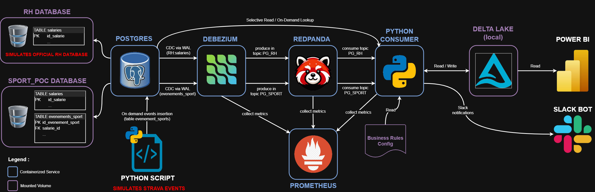

# 🏃‍♂️ Sport & HR Streaming POC

**Table of contents**

- [Project Goal](#-project-goal)
- [What This POC Demonstrates](#-what-this-poc-demonstrates)
- [Pipeline Architecture and Workflow](#-pipeline-architecture-and-workflow)
	- [Main steps](#-main-steps)
	- [Pipeline Diagram](#-pipeline-diagram)
- [Tech Stack](#-tech-stack)
- [Running the Project](#-running-the-project)
	- [Prerequisites](#-prerequisites)
	- [Start the services](#-start-the-services)
	- [Simulate sport events](#-simulate-sport-events)
- [Outputs and Results](#-outputs-and-results)
- [Possible Improvements](#-possible-improvements)

---

## 🎯 Project Goal

This project is a **Data Engineering Proof of Concept** that demonstrates a **real-time data streaming pipeline** for tracking employee sport activities and computing HR-related insights such as:
- Annual bonuses based on activity
- Wellness day eligibility
- Real-time Slack notifications
- Data quality validation for HR & sport data

The goal is to validate both the technical architecture and the business rules in a **modern streaming & lakehouse context**.

---

## 🧠 What This POC Demonstrates

- **CDC from PostgreSQL** using Debezium  
- **Event streaming** with Kafka (Redpanda)  
- **Python-based stream processing** with micro-batch handling  
- **Data lakehouse architecture** with Delta Lake (Bronze → Silver → Gold)  
- **Data quality checks** using Great Expectations  
- **Real-time notifications** via Slack  
- **Basic observability** with Prometheus  

This POC is designed to show **end-to-end streaming processing** and **data reliability** for business use cases.

---

## 🗂️ Pipeline Architecture and Workflow

### Main steps:

1. **Data Generation & CDC**
   - HR and sport event data are stored in PostgreSQL (rh and sport_poc databases) to simulate real-world scenarios
   - Logical replication enabled for CDC
   - Debezium captures changes and publishes to Kafka topics

2. **Event Streaming**
   - Redpanda (Kafka) serves as the central event bus, transporting all change events captured from the databases
   - Debezium publishes HR data changes to pg_rh.public.salaries and sport activity events to pg_sport.public.evenements_sport
   - Allows downstream services to consume updates in real time, enabling reactive pipelines and near-instant synchronization across systems

3. **Stream Processing**
   - Python consumer reads from Kafka
   - Applies business rules:
     - Eligibility for wellness days
     - Bonus computation
     - Home-to-work distance calculation (OSMNX + BAN API)
   - Sends Slack notifications
   - Writes cleaned and enriched data to Delta Lake

4. **Lakehouse Storage**
   - **Bronze**: Raw CDC events
   - **Silver**: Cleaned and historized SCD Type 2 tables
   - **Gold**: Business-ready aggregates

5. **Monitoring & Quality**
   - Prometheus scrapes metrics from the consumer
   - Great Expectations validates data in each layer
   - Alerts generated for inconsistencies

---

### Pipeline Diagram



---

## ⚙️ Tech Stack

- **Containerization**: Docker, Docker Compose
- **Databases**: PostgreSQL
- **CDC**: Debezium
- **Streaming**: Redpanda (Kafka)
- **Processing**: Python
- **Data Lakehouse**: Delta Lake
- **Data Quality**: Great Expectations
- **Monitoring**: Prometheus
- **Notifications**: Slack API
- **Geospatial**: OSMNX, BAN API

---

## 🚀 Running the Project

### Prerequisites
- Docker & Docker Compose installed
- Python >=3.11 to simulate random sport events
- One of the following:
  - **Set environment variables manually:**
    ```bash
    export POSTGRES_ADMIN_USERNAME="your_admin_username"
    export POSTGRES_ADMIN_PW="your_admin_password"
    export MOCK_SLACK_MESSAGE=true
    export SLACK_BOT_TOKEN="your_token"         # optional, only needed if MOCK_SLACK_MESSAGE=false
    export CHANNEL_ID="your_channel_id"         # optional, only needed if MOCK_SLACK_MESSAGE=false
    ```
  - **Or** copy `.env.example` to `.env` and replace placeholders with your own values:
    ```bash
    cp .env.example .env
    # Then edit .env to set your variables
    ```

### Start the services

```bash
docker compose up -d
```

⚠️ First launch might take a few minutes.

The init-services container automatically:
- Initializes PostgreSQL databases
- Loads CSV seed data
- Registers Debezium connectors

### Simulate sport events

```bash
python ./py/create_sport_events.py -e 100 #adjust number of events to create
```

## 📊 Outputs and Results
The pipeline produces:
- Raw CDC events stored in Bronze layer
- Cleaned & historized tables in Silver layer
- Aggregates & business KPIs in Gold layer
- Slack notifications for employee activities
- Prometheus metrics for pipeline observability
- Data quality validation reports

## 🔍 Possible Improvements
- Implement schema evolution handling for CDC changes
- Add fault tolerance and exactly-once semantics in stream processing
- Enhance monitoring dashboards (Grafana, alerting)
- Support multi-region or cloud deployment
- Add unit tests and integration tests for the Python consumer
- Extend Slack notifications with rich formatting or reporting